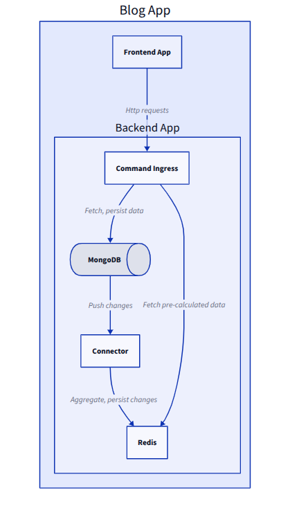
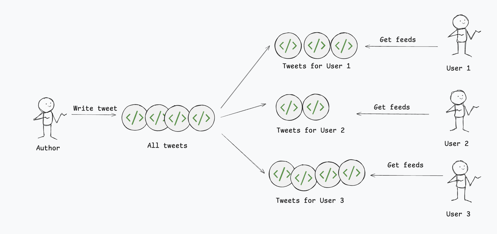

# Blog App

The platform for sharing knowledge, which contains three components:
- Frontend application
- Backend API (command-ingress)
- MongoDB-Redis connector

How to run:
  - ```docker compose up```
  - ```npm run dev:comamnd-ingress```

How to run test:
  - ```npm run test``` (Make sure you Docker is enabled)

Architecture: 


## Feed System Design

### Recipe
 - User's feed could contains posts from:
   - Following users

### Distribute Post
#### Fan-out on read
- At the first approach, we could just query directly from the database:
```
import mongoose from 'mongoose';

// Assuming you have Post and User models defined with Mongoose
const Post = mongoose.model('Post');
const User = mongoose.model('User');

async function getFollowingPosts(currentUserId: mongoose.Types.ObjectId) {
  try {
    const posts = await Post.aggregate([
      {
        $lookup: {
          from: 'users',
          localField: 'sender_id',
          foreignField: '_id',
          as: 'user',
        },
      },
      {
        $unwind: '$user',
      },
      {
        $lookup: {
          from: 'follows',
          localField: 'user._id',
          foreignField: 'followee_id',
          as: 'followers',
        },
      },
      {
        $match: {
          'followers.follower_id': currentUserId,
        },
      },
    ]);

    return posts;
  } catch (error) {
    console.error('Error fetching posts:', error);
    throw error;
  }
}

```
- Although this approach works well at first, heavy load will stress the database at scale.
- Benchmark result by using k6


#### Fan-out on write
- Along side of fetching posts on read requests, we could pre-build user's feeds contents which data is stored on fast-access storage like Redis, Memcache, Valkey, ...
- With fan-out on write, the post will be distributed to followers cache:
  
- When user request for their feed, we could just query from the cache:
```
- Drawbacks:
  - We could easily observe that if users has a large amout of followers, than fan-out on write pattern could lead to a huge amount of write operations